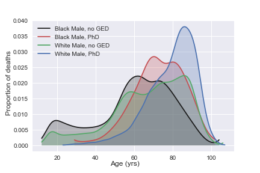
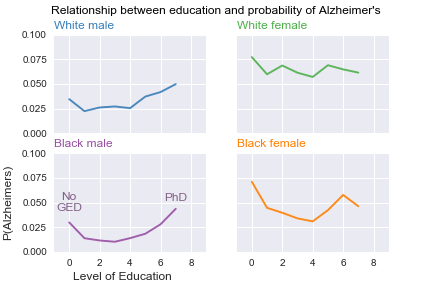

# Countdown

This is a quick analysis of a few years from the CDC mortality dataset.

It looks at the distributions of when people die, broken down by a few demographic features. 

### Race, education, and mortality

For example, I looked at males in the two top classes for race in the US (i.e., white and black) and tried to understand the impact of education on their life expectancy.

For white males, getting a PhD didn't shift the most likely age of death from the "no-GED" category. Both peaked at roughly 85 years old. However, getting a PhD was associated with reduced odds of an earlier death (from early 20s to mid 60s) compared to no-GED.

For black males, getting a PhD was associated with a roughly 10 year increase in life expectancy over those who didn't get their GED.

### Drilling down into a cause of death

We can also look at how education and race interact with a particular cause of death. I chose to look at Alzheimer's disease. Lots of brain training products and popular science literature suggest that there are neuro-protective benefits of "working out" your brain through learning and puzzle-solving. Some recent research has painted a much more complicated picture of the benefits of such activities. 

I thought I'd see if there might be a relationship between education and whether people died of Alzheimer's (versus all the other potential causes of death). 

In these plots, the level of education ranges from 0 (i.e., didn't start high school) to 7 (i.e., PhD).

With males, there appears to be a U-shaped function describing the relationship between education and the probability of dying from Alzheimer's. Females are more complicated; white females essentially have an equally high probability of dying from Alzheimer's across all levels of education. For black females, there may be a U-shape, similar to the males. 

Note that this is metric is not the same as the probability of developing Alzheimer's. In one sense, it isn't surprsing that the probability of dying from Alzheimer's increases with the level of education -- people who live long enough to get a PhD are perhaps more likely to live long enough to die from Alzheimer's. The surprising (and surprisingly consistent) trend is that you are more likely to die from Alzheimer's if you didn't start or finish high school. 

There are many potential explanations for this relationship, but it isn't inconsistent with the idea that a trajectory of higher education tends to ward off Alzheimer's. Before accepting that hypothesis, however, one would want to rule out other predictors that are typically correlated with education, like income, geography, measures of health, etc.

